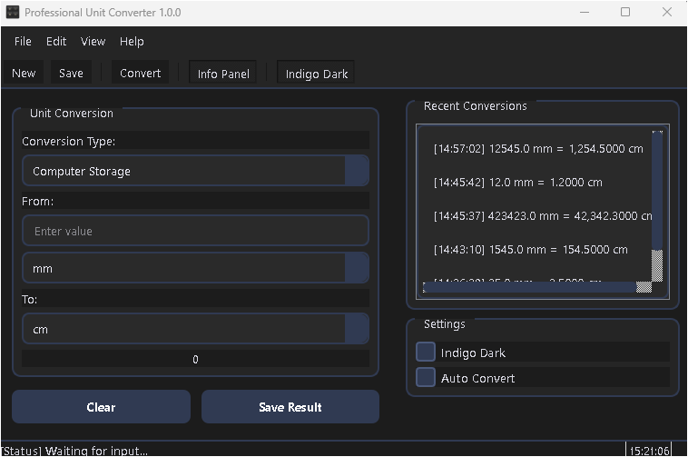
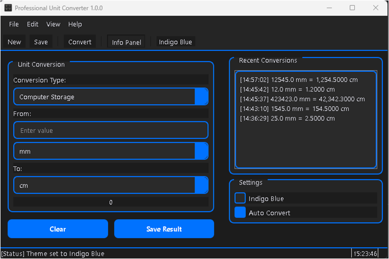
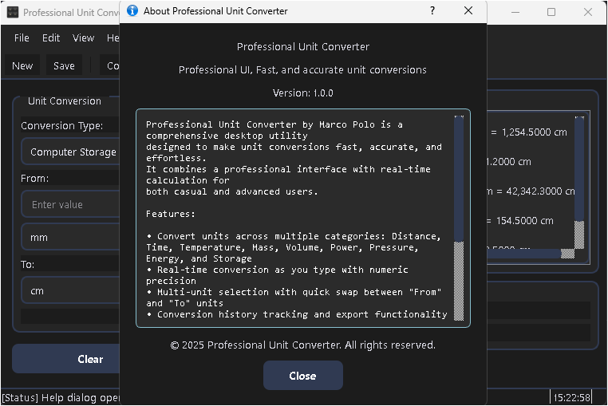
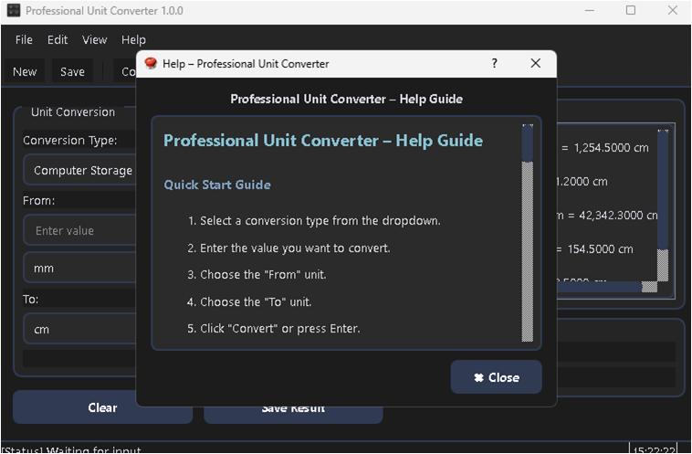
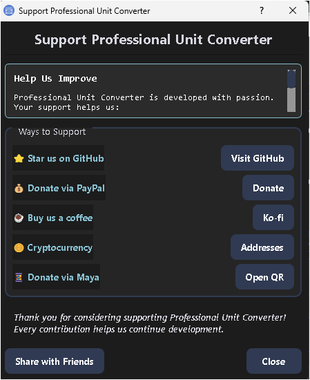

# Professional Unit Converter 🧮

 


**Professional Unit Converter** – Multi-Category Unit Conversion Tool  
Developed by **Marco Polo | PatronHub**  

---

## 📂 Project Structure

```
Professional-Unit-Converter/
│
├─ Professional_Unit_Converter.py      # Main application entry point
├─ README.md                           # Project documentation
├─ LICENSE                             # MIT License file
├─ requirements.txt                    # Python dependencies
│
├─ core/                               # Backend conversion logic
│   ├─ __init__.py
│   └─ unit_conversion.py              # Conversion formulas and mappings
│
├─ dialogs/                            # Modular PyQt5 dialogs
│   ├─ __init__.py
│   ├─ About_Dialog.py                 # About window
│   ├─ Help_Dialog.py                  # Help instructions window
│   ├─ Donate_Dialog.py                # Donation dialog with QR/PayPal/Ko-fi
│   └─ History_Dialog.py               # Conversion history viewer
│
├─ themes/                             # QSS theme files
│   └─ apply_themes.py                 # Functions to load Dark/Light themes
│
├─ app_config/                          # App constants & IDs
│   ├─ __init__.py
│   └─ app_config.py                    # APP_NAME, APP_VERSION, payment IDs, ICON_PATH
│
├─ assets/                              # Resources and screenshots
│   └─ screenshots/
│       ├─ main_window.png
│       ├─ history_panel.png
│       ├─ about_dialog.png
│       └─ donate_dialog.png
└─ resources_rc.py                      # Compiled Qt resource file (.qrc)
                  # Environment variables (API keys, secrets, etc.)
```

## 📘 Overview
**Professional Unit Converter** is a cross-platform desktop application built with **Python 3** and **PyQt5**.  
It provides lightning-fast, accurate, and elegant unit conversions across multiple categories — all in a professional, resizable interface with theme switching, live status updates, and exportable history.

---

## ⚡ Features
- 🧩 **Multi-Category Conversion**: Distance, Temperature, Mass, Volume, Time, Power, Pressure, Energy, Storage  
- ⚙️ **Real-Time Conversion**: Auto-convert as you type  
- 📜 **Conversion History**: Store, view, and export results to JSON  
- 🕹 **Dynamic Status Bar**: `[Status] Converting... | [Clock] 12:34:56`  
- 🎨 **Theme Switching**: Toggle between *Indigo Dark* and *Indigo Blue* themes  
- 🧠 **Auto Convert Option**: Enable or disable instant conversion mode  
- 🧾 **Keyboard Shortcuts** for faster operation  
- 🪶 **Modern UI**: Resizable layout, grouped settings, and minimalist design  
- 💾 **Offline Mode**: 100% functional without internet connection  

---

## 🖼 Screenshots

**Main Conversion Panel:**



**Indigo Blue Theme Panel:**



**About Dialog:**



**Help Dialog:**



**Donate Dialog:**



---

## 🚀 Installation

1. Clone the repository:

```
git clone https://github.com/j3fcruz/Professional_Unit_Converter.git
cd Professional_Unit_Converter
```

2. (Optional) Create a virtual environment:

```
python -m venv venv
source venv/bin/activate  # Linux/Mac
venv\Scripts\activate     # Windows
```

3. Install dependencies:

```
pip install -r requirements.txt
```

4. Run the application:

```
python main.py
```

---


## ⚙ Dependencies

```
Python >= 3.10
PyQt5>=5.15.7
```

Install via pip:

```
pip install -r requirements.txt
```

---

## 🧠 Modules Overview

| Module                       | Description                                                       |
|------------------------------|-------------------------------------------------------------------|
| **main.py**                  | Entry point to launch the MonitorGlow application                 |
| **ui/main_window.py**        | Main UI and core application logic, system tray integration       |
| **dialogs/About_Dialog.py**  | About dialog window with app info and credits                     |
| **dialogs/Donate_Dialog.py** | Donate dialog window with QR codes, PayPal, Ko-fi, and crypto     |
| **dialogs/Help_Dialog.py**   | Help dialog window with usage instructions and tips               |
| **dialogs/History_Dialog.py**| History dialog window for all history and logs                    |
| **core/crypto_utils.py**     | Encryption/decryption utilities for secure QR donations           |
| **core/unit_conversion.py**  | All Unit Conversion Logic                                         |
| **config/app_config.py**     | Application constants, links, QR keys, and configuration settings |
| **resources_rc.py**          | Compiled Qt resource file (.qrc) including icons and QR files     |
| **assets/screenshots/**      | UI screenshots for documentation                                  |
| **.env**                     | Environment variables (API keys, secrets, etc.)                   |
---

## ⌨️ Keyboard Shortcuts
| Module                      | Description |
|-----------------------------|-------------|
| New Conversion              | Ctrl + N    |
| Save Result                 | Ctrl + S    |
| open History                | Ctrl + O    |
| Export History              | Ctrl + E    |
| Clear Input                 | Esc         |
| Help                        | F1          |
| Quit                        | Ctrl + Q    |


## 🎨 Themes

- Indigo Dark theme (default) for better night visibility  
- Optional Indigo Blue theme for professional look

---

## 🛠 Contributing

1. Fork the repository.  
2. Create a new branch: `git checkout -b feature/YourFeature`.  
3. Make your changes.  
4. Commit: `git commit -m 'Add YourFeature'`.  
5. Push: `git push origin feature/YourFeature`.  
6. Submit a Pull Request.  

---

## 📜 License

**Professional Unit  Converter** is licensed under the **MIT License**. See the LICENSE file for details.  
© 2025 Marco Polo | PatronHub. All rights reserved.  

---

## 💖 Support & Donate

If you love this project and want to support development:

GitHub: [@j3fcruz](https://github.com/j3fcruz)  
Ko-fi: [@marcopolo55681](https://ko-fi.com/marcopolo55681)

💰 PayPal: [@jecfcruz](https://paypal.me/jofreydelacruz13)  

🪙 Crypto: BTC 1BcWJT8gBdZSPwS8UY39X9u4Afu1nZSzqk,ETH xcd5eef32ff4854e4cefa13cb308b727433505bf4

---

## 🧠 Credits

* Developed with ❤️ by Marco Polo
* Powered by Python 3 + PyQt5
* Crafted under PatronHub Labs

---

## 📝 Notes

* 💡 This application works fully offline, ensuring data privacy and speed.
* 🎨 The Indigo Dark and Indigo Blue themes dynamically change the entire interface color scheme.
* 🧮 All conversions are based on precise floating-point calculations to ensure professional-grade accuracy.
* 🧾 Conversion history is stored locally in JSON format — no data is ever sent online.
* 🧠 Optimized for both casual users and professionals needing accurate, fast conversions.
* 🔒 Built without telemetry or background network calls — 100% user-controlled.
* 🪟 Windows and Linux builds available via PyInstaller; cross-platform ready.
